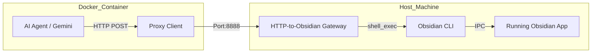

# http-to-obsidian-cli-gateway 🚀

[English](#english) | [简体中文](#简体中文)

---

<a name="english"></a>
## English

> **The Bridge between Isolation and Intelligence.**

[](LICENSE)
[](https://help.obsidian.md/cli)
[](https://www.docker.com/)

### 📖 Introduction
This repository is a lightweight **HTTP Proxy Gateway** designed to solve the isolation problem for AI agents (like Gemini or Claude running in Docker/Sandbox) that cannot directly access the **Obsidian CLI** on the host machine.

It opens a protected port on the host, receives `eval` or `search` commands from the container, invokes the host Obsidian process, and returns real-time results.

#### Core Value
*   **Sandbox Traversal**: Empowers agents in isolated containers to control desktop applications on the host.
*   **Active Brain Access**: AI accesses Obsidian memory (`metadataCache`) directly, bypassing disk scans for 100x speed improvement.
*   **Zero Intrusiveness**: No Obsidian plugins required, just the official CLI.
> **Performance**: Analyzed 5,800+ notes and 1,900+ links in ~300ms, with complex graph hub analysis in ~3.9s via Docker traversal.

### 🛠️ Features
*   **Dynamic Code Execution (`/eval`)**: Send arbitrary JS to Obsidian and get JSON results.
*   **Global Search (`/search`)**: Resolve fuzzy keywords into full vault paths.
*   **Path Translation**: Automatic handling of path mapping between host and container.
*   **Security Auth**: Simple token verification to prevent unauthorized access.
*   **Streaming Logs**: Monitor all container requests in real-time.

### 📦 Quick Start
1. **Prepare (Host)**: Obsidian v1.12+ running, CLI enabled in settings, Node.js v16+ installed.
2. **Install & Run**:
   ```bash
   git clone https://github.com/your-username/http-to-obsidian-cli-gateway.git
   cd http-to-obsidian-cli-gateway
   npm install
   node src/server.js
   ```
3. **Invoke (Docker)**:
   ```bash
   curl -X POST http://host.docker.internal:8888/eval \
        -H "Content-Type: application/json" \
        -d '{"vault": "MyNotes", "code": "app.vault.getFiles().length"}'
   ```

---


### 🚀 Usage from Docker (Client Side)

#### 1. Direct HTTP API (Curl)
The simplest way to interact with the gateway is via standard HTTP POST requests.
```bash
# Get note count
curl -X POST http://host.docker.internal:8888/eval \
     -H "Content-Type: application/json" \
     -d '{"code": "app.vault.getMarkdownFiles().length"}'

# Search for a specific note
curl -X POST http://host.docker.internal:8888/search \
     -H "Content-Type: application/json" \
     -d '{"query": "ESG", "limit": 5}'
```

#### 2. Python CLI Wrapper (Seamless Integration)
We provide a Python script `src/client-proxy.py` that can be used as a drop-in replacement for the `obsidian` command inside Docker.
1. Copy `src/client-proxy.py` into your Docker container.
2. Alias or symlink it to `obsidian`: `ln -s /path/to/client-proxy.py /usr/local/bin/obsidian`.
3. Now you can run standard Obsidian CLI commands directly:
   ```bash
   obsidian vault="MyVault" eval code="app.vault.getName()"
   ```

<a name="简体中文"></a>
## 简体中文

> **跨越孤岛与智能的桥梁。**

### 📖 项目简介
本仓库是一个轻量级的 **HTTP 代理网关**，专门用于解决 AI 智能体（如运行在 Docker/Sandbox 中的 Gemini 或 Claude）无法直接访问宿主机 **Obsidian CLI** 的痛点。

它在宿主机上开启一个受保护的端口，接收来自容器的 `eval` 或 `search` 指令，调用宿主机的 Obsidian 进程并返回实时计算结果。

#### 核心价值
*   **跨越沙箱隔离**：让运行在隔离容器内的 AI 具备操控宿主机桌面端应用的能力。
*   **保持“大脑”活性**：AI 直接访问 Obsidian 内存中的 `metadataCache`，无需扫描磁盘文件，速度提升 100x。
*   **零侵入性**：无需修改 Obsidian 插件，只需宿主机开启官方 CLI 功能。
> **性能表现**：通过 Docker 穿透测试，在 ~300ms 内完成 5800+ 笔记及 1900+ 链接的统计，在 ~3.9s 内完成复杂的全库图谱枢纽分析。

### 🛠️ 功能特性
*   **动态代码执行 (`/eval`)**：支持发送任意 JavaScript 到 Obsidian 内部执行并返回 JSON。
*   **全局搜索 (`/search`)**：快速将模糊关键词解析为 Vault 中的完整路径。
*   **路径映射 (Path Translation)**：自动处理宿主机与容器之间挂载路径的差异。
*   **安全认证**：支持简易 Token 校验，防止未授权访问宿主机。
*   **流式日志**：实时监控来自容器的所有请求记录。

### 📦 快速开始
1. **环境准备 (宿主机)**：Obsidian v1.12+ 已运行，设置中已开启 CLI，已安装 Node.js v16+。
2. **安装与启动**：
   ```bash
   git clone https://github.com/your-username/http-to-obsidian-cli-gateway.git
   cd http-to-obsidian-cli-gateway
   npm install
   node src/server.js
   ```
3. **在 Docker/Sandbox 中调用**：
   ```bash
   curl -X POST http://host.docker.internal:8888/eval \
        -H "Content-Type: application/json" \
        -d '{"vault": "MyNotes", "code": "app.vault.getFiles().length"}'
   ```

---


### 🚀 Docker 端使用方法 (客户端)

#### 1. 直接通过 HTTP API (Curl)
最简单的方式是直接发送 HTTP POST 请求。
```bash
# 获取笔记总数
curl -X POST http://host.docker.internal:8888/eval \
     -H "Content-Type: application/json" \
     -d '{"code": "app.vault.getMarkdownFiles().length"}'

# 搜索特定笔记
curl -X POST http://host.docker.internal:8888/search \
     -H "Content-Type: application/json" \
     -d '{"query": "ESG", "limit": 5}'
```

#### 2. Python CLI 包装脚本 (无感接入)
项目提供了 `src/client-proxy.py` 脚本，可以作为 Docker 内部 `obsidian` 命令的替代品。
1. 将 `src/client-proxy.py` 拷贝到 Docker 容器内。
2. 将其设置为别名或创建软链接：`ln -s /path/to/client-proxy.py /usr/local/bin/obsidian`。
3. 现在你可以在容器内直接运行标准的 Obsidian CLI 命令：
   ```bash
   obsidian vault="MyVault" eval code="app.vault.getName()"
   ```

## 🏗️ Architecture / 技术架构



## 📄 License / 开源协议
[MIT License](LICENSE)

---

## 🚀 Automatic Startup / 自动启动方案

### Option: Obsidian Shell Commands Plugin / 方案：Obsidian Shell Commands 插件
To automatically start the gateway when Obsidian launches:
1. Install the **Shell Commands** community plugin in Obsidian.
2. Go to `Settings -> Shell Commands -> Events`.
3. Enable the **Obsidian starts** event.
4. Add a new shell command: `node /path/to/http-to-obsidian-cli-gateway/src/server.js`.
5. (Optional) Set output to "Ignore" to run silently in the background.

这样，只要你打开 Obsidian，网关就会自动在后台启动，实现 AI 助手对知识库的无缝接入。
