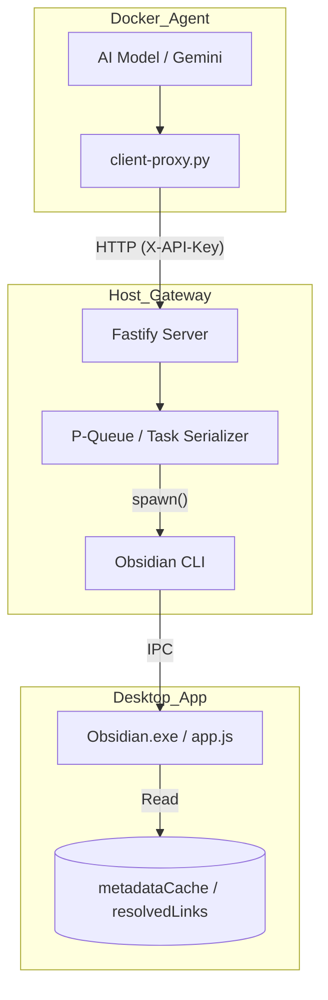

# http-to-obsidian-cli-gateway 🚀 (v2.1 Graph Optimized)

[English](#english) | [简体中文](#简体中文)

---

<a name="english"></a>
## English

> **The High-Performance Bridge between Isolation and Intelligence.**

[](LICENSE)
[](https://help.obsidian.md/cli)
[](https://www.fastify.io/)
[](https://www.docker.com/)

### 📖 Introduction
This repository is an optimized **HTTP Proxy Gateway** designed for high-performance interaction between AI agents (running in Docker/Sandbox) and the **Obsidian CLI** on the host machine.

The v2.1 update adds advanced graph traversal capabilities, enabling AI to navigate complex knowledge structures like ESG and CCUS clusters directly via memory.

#### 🚀 v2.1 Optimizations
*   **Knowledge Graph Traversal**: New `/graph` endpoint performs localized BFS/DFS (nodes & edges) centered around a specific note, avoiding massive data transfers.
*   **Fastify Framework**: High-performance HTTP stack with ~30% lower latency than Express.
*   **Task Queue (P-Queue)**: Request serialization to prevent "race conditions" and host resource spikes.
*   **Spawn over Exec**: Secure process handling with stream monitoring.
*   **Metadata Search**: Leverages `metadataCache` for sub-millisecond fuzzy search.

### 🛠️ Features
*   **Dynamic Code Evaluation (`/eval`)**: Execute arbitrary JS in the active Obsidian process.
*   **In-Memory Search (`/search`)**: Fuzzy search over 10k+ notes in milliseconds.
*   **Graph Exploration (`/graph`)**: Fetch localized nodes and edges for relationship mapping.
*   **API Key Security**: Mandatory `X-API-Key` authentication.
*   **Health Monitoring (`/health`)**: Built-in verification of CLI responsiveness.

---

## 🧠 Integrating with Graph Query Algorithms

The v2.1 Gateway is designed to be the "execution engine" for the **[obsidian-graph-query](https://github.com/zhihaol/obsidian-graph-query)** project. By combining the Gateway's `/eval` endpoint with pre-defined graph templates, you can perform advanced analysis on your knowledge base.

### 🔗 Synergy with `obsidian-graph-query`
The Gateway provides the high-performance transport, while `obsidian-graph-query` provides the logic. 

**Common Workflow:**
1.  **Template Selection**: Pick an algorithm (e.g., Shortest Path, Tarjan's Bridges).
2.  **Parameter Injection**: Replace placeholders (like `{{NOTE_PATH}}`) with actual vault paths.
3.  **Gateway Execution**: Send the resulting JS to the `/eval` endpoint.
4.  **Insight Extraction**: Receive a JSON object containing graph nodes, edges, and metrics.

### 🚀 Localized Graph Traversal Example
Instead of loading all 5,000+ notes, use `/graph` for a "flashlight" view of specific clusters.

```bash
# Get nodes and edges within 2 hops of "CCUS/Cluster-A"
curl -X POST http://localhost:8888/graph \
     -H "X-API-Key: $OBSIDIAN_GATEWAY_KEY" \
     -H "Content-Type: application/json" \
     -d '{
       "central_node": "CCUS/Cluster-A.md",
       "depth": 2
     }'
```

### 🌉 Bridge Detection Example (Complex Query)
To find "Knowledge Bridges" (notes that connect two otherwise isolated clusters), use the `/eval` endpoint with a Tarjan template:

```bash
curl -X POST http://localhost:8888/eval \
     -H "X-API-Key: $OBSIDIAN_GATEWAY_KEY" \
     -d '{"code": "(() => { /* Tarjan Bridge Algorithm */ })()"}'
```

---

### 📦 Quick Start (Host)
1. **Prepare**: Ensure Obsidian v1.12+ is running with CLI enabled.
2. **Install**: `npm install`
3. **Configure**: Create a `.env` file.
   ```env
   OBSIDIAN_GATEWAY_KEY=your_secret_token
   ```
4. **Run**: `npm start`

### 🚀 Usage from Docker (Client)

#### 1. Python Proxy (Recommended)
```bash
export OBSIDIAN_GATEWAY_URL="http://host.docker.internal:8888"
export OBSIDIAN_GATEWAY_KEY="your_secret_token"

# Search
python3 src/client-proxy.py search query="AI Ethics" limit=5

# Graph (2 levels deep)
python3 src/client-proxy.py graph central_node="CCUS/Policy" depth=2
```

#### 2. Direct HTTP API
```bash
curl -X POST http://localhost:8888/graph \
     -H "X-API-Key: your_secret_token" \
     -H "Content-Type: application/json" \
     -d '{"central_node": "CCUS/Policy", "depth": 2}'
```

---

<a name="简体中文"></a>
## 简体中文 (v2.1 图谱优化版)

### 🚀 v2.1 核心改进
*   **知识图谱遍历**：新增 `/graph` 接口，支持以特定笔记为中心进行局部 BFS/DFS 遍历（返回节点与边），适用于 ESG/CCUS 等复杂关系链分析。
*   **高性能架构**：基于 Fastify 与 P-Queue，确保并发请求下的系统稳定性。
*   **内存级检索**：直接访问 `metadataCache`，无需磁盘扫描。

---

## 🏗️ Architecture / 技术架构



## 📄 License / 开源协议
[MIT License](LICENSE)
